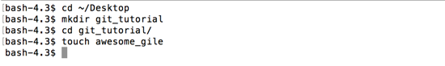

# Setup

## Folder Setup

If you are starting this tutorial after having just finished the related _Command Line Tutorial_, you can skip this setup.  Just be sure you are still in your `git_tutorial` directory.

If not, please open a terminal and follow the steps below to create the expected directory and file.

```
$ cd ~/Desktop
$ mkdir git_tutorial
$ cd git_tutorial
$ touch awesome_file
```



## GitHub Username

If you are going through this during a live workshop, hopefully the presenter or someone else has started (or finished) collecting your GitHub usernames.  They will be needed when we get to the GitHub related portion to demonstrate different concepts.

If you are going through this at home, you will have the option to _fork_ the repo before you _clone_ it.  You'll miss out on experiencing some of the collaborative examples, but screenshots will be provided.
