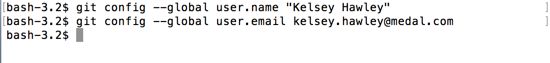

# git config

Before you start using `git`, if this is the first time you've installed it on your machine, you'll need to add some configuration information first.

The basic configs you'll need to add are your name, and your email.  If you already have a GitHub account, be sure to use the same email as your GitHub login.

Be sure to type _your_ name and email below!

```
$ git config --global user.name "John Doe"
$ git config --global user.email johndoe@example.com
```



