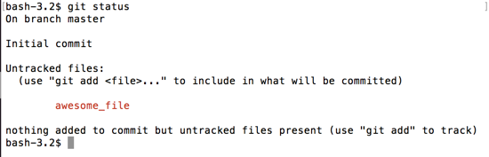

# git status

How do we know if this is really a git repo?

```
$ git status
```



You can see it mentions an _Initial commit_, meaning the repo was just created, and nothing has been committed yet.  You can also see our `awesome_file` in red and called 'untracked'.

An **untracked file** is a file that hasn't been explicitly added to git yet.  It doesn't know it should be keeping track of changes to that file.
