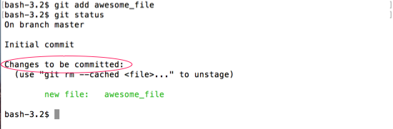
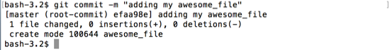

# git commit

## Staging

Now that we've _added_ our file, we're ready to commit it.  Its important to understand that we haven't finished 'saving' our changes yet.  By _adding_ the file, we have _staged_ it.

The **staging area** is the storage area for what will go into your next commit.  You will explicitly add things to this area before you commit them.  Anything not in this area, will not be committed.

You can see that `awesome_file` is in an area designated "Changes to be committed".  It also mentions a command to _unstage_ the file (more on that later).



## Commit

With our `awesome_file` staged, lets commit it to our repo.

A **commit** is like an entry into our git history that contains a set of changes and an explanatory message.

`git commit` is the command to save those staged changes.  We'll use `git commit -m "<commit_message>"`.  The `-m` allows us to add our explanatory message write on the command line.  That way we don't need to worry about opening an editor.

```
$ git commit -m "adding my awesome_file"
```



You can see that this commit had 1 file added, and 0 insertions and deletions (because the file was empty).
