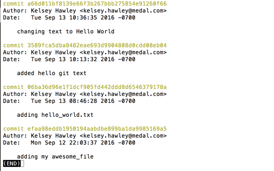
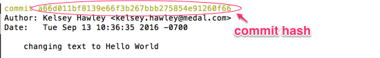
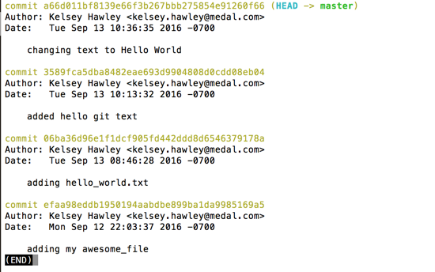
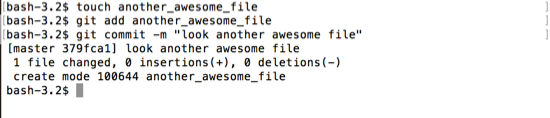
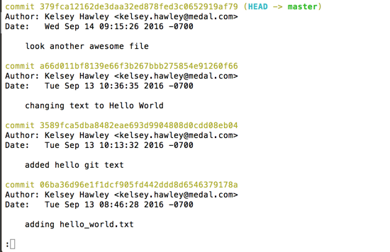

# git log

We've made a couple of commits at this point.  Let's take a look at that history.

`git log` will bring up a list of our commits, along with who made the commit, the date, the message, and a _hash_.  As with `git diff`, use `q` to exit this view.

```
$ git log
```



A **commit hash** (also referred to as _sha_) is the string of letters and numbers assigned to commit.  It is the computed 'value' of the changes, the commit message, the author, the date and some other things related to that commit.  The result is a long, but very _unique_ string.
 


Git also assigns aliases or common names to some hashes.  For example, `HEAD` is the common name for the top of your commit history, your most recent commit.

To see these aliases, use `git log --decorate`

```
$ git log --decorate
```



Our most recent commit "changing text to Hello World" has the `HEAD` alias after it.

If we make a new commit, `HEAD` will move to the most recent commit.  Lets create another blank file with touch and commit it.

```
$ touch another_awesome_file
$ git add another_awesome_file
$ git commit -m "look another awesome file"
```



Now if we look at our log, we'll see that `HEAD` is now on our new commit which is the most recent commit.

```
$ git log --decorate
```



You may also notice that the list of commits in my history is longer than my terminal window.  Instead of saying _END_ like before, there is a _:_ .  To view more of your history, you can use the arrow keys to scroll up or down in this window.  Again, `q` to return to the command line prompt.
