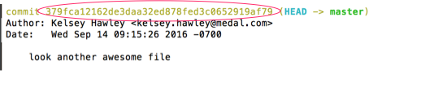
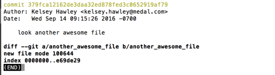
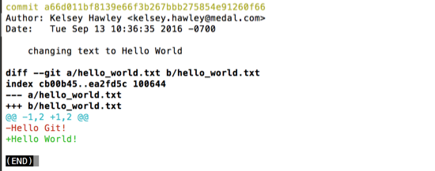

# git show

To see the changes in a particular commit, use `git show`.

`git show <commit_hash>` has an argument of a commit hash.  It will show the commit metadata (author, date, hash) and the diff of that commit (the changes made in that commit.)

**_NOTE:_** Your commit history will differ from the screenshots shown, since your author and dates will be different.  As a result, _your commit hashes will not be the same either_.



Using the hash from the example commit log, the command will look like:

```
$ git show 379fca12162de3daa32ed878fed3c0652919af79
```



We can see that this commit added the new file `another_awesome_file`.

If we look at the previous commit, we'll see the change of our text from `Hello Git` to `Hello World`.

_Remember your hash will be different than the example._


```
$ git show a66d011bf8139e66f3b267bbb275854e91260f66
```




## hash shortcuts

It's interesting to note that these hashes are _so unique_ that you can use the first 8 characters when referencing a commit.

For example, `git show a66d011bf8139e66f3b267bbb275854e91260f66` and `git show a66d011b` will show the same commit.

We can also use the alias `HEAD` if we want to see the most recent commit, since `HEAD` is always a pointer to the most recent commit's hash.

For example, `git show 379fca12162de3daa32ed878fed3c0652919af79` and `git show HEAD` will show the same commit.
