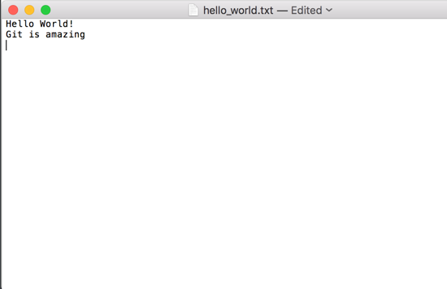
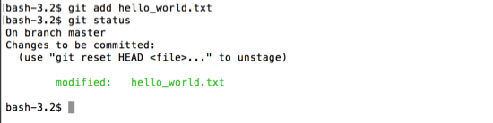
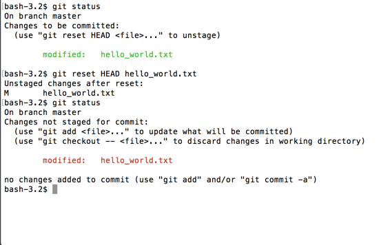
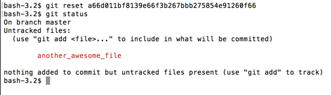
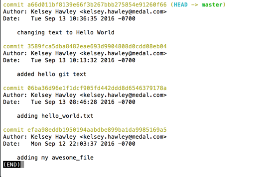
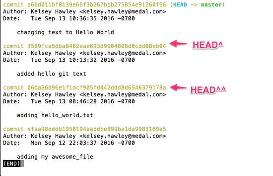

# git reset

`git reset` is used to reset the current HEAD to a specified state.  It has many different uses.

## Unstage

It can be used to _unstage_ some changes.

For example, let's edit our `hello_world.txt`.  Let's add a line that says "Git is amazing".



And lets add it, but _not_ commit it.  Then let's look at our `git status`.

```
$ git add hello_world.txt
$ git status
```



Remember that `git add` puts the changes into a _staging area_.  The staging area has the changes we are _ready to commit_.

If we changed our mind, and no longer wanted to _commit_ that text change, we can use `git reset HEAD <file>` to take it our of the staging area, and put it back into our working directory.

If you look at the `git status` more closely, you'll even see this as a recommended option for unstaging.


Let's run that command and then `git status`.

```
$ git reset HEAD hello_world.txt
$ git status
```



`git reset HEAD <file>` takes the specified file, and _resets_ that file in the staging area to the state it was at the `HEAD` or most recent commit.  In short terms, it removes that file's changes from the staging area, but keeps them in your working directory.

Lets remove that text "Git is amazing" text from `hello_world.txt` in the text editor so that our `git status` is empty again.


## Rollback

Remember that `another_awesome_file` commit we made? We really didn't need that, so lets get rid of it and roll it back.

`git reset <hash>` will rollback your history to that commit, essentially _removing_ any commits that came after it in your history.  _Note:_  your changes will still exist in your directory, but the commits that made them will be gone.

For example, grab the commit hash where we changed `Hello Git` to `Hello World`

```
$ git reset a66d011bf8139e66f3b267bbb275854e91260f66
$ git status
```



If you look at the status, you'll see that `nother_awesome_file` is in our _untracked files_.

If we look at the log, we'll see that the commit is gone too and the `HEAD` is now pointing to the commit we reset to.

```
$ git log --decorate
```



Since we don't want `another_awesome_file` anymore, lets delete it.  It will also disappear from our _untracked files_ in `git status`.

```
$ rm another_awesome_file
$ git status
```


## Another Alias

We've learned that `HEAD` is a pointer to the most recent commit.  Another type of shortcut builds on `HEAD` to point to the previous commit.  `HEAD^` points to the commit before `HEAD` and `HEAD^^` points to 2 commits before `HEAD`.  You can keep adding `^` to `HEAD` to point even further back.  However, I recommend using the actual _hash_ for commits more than one or two behind `HEAD`.



We could have `HEAD^` in our previous rollback example, shortening `git reset a66d011bf8139e66f3b267bbb275854e91260f66` to `git reset HEAD^`
