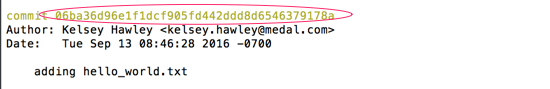
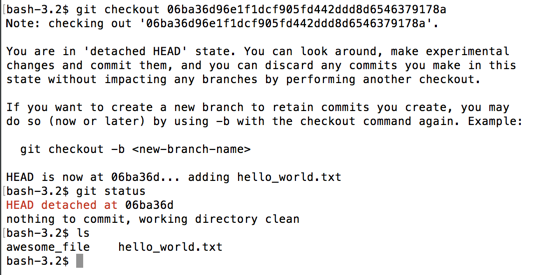
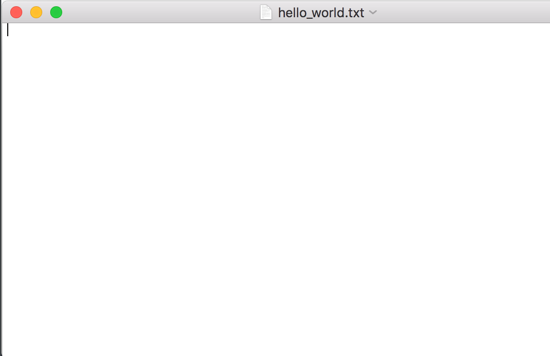
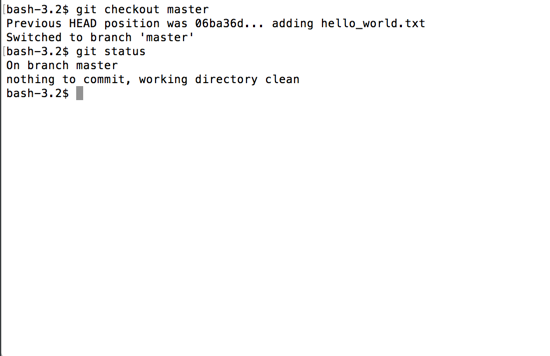
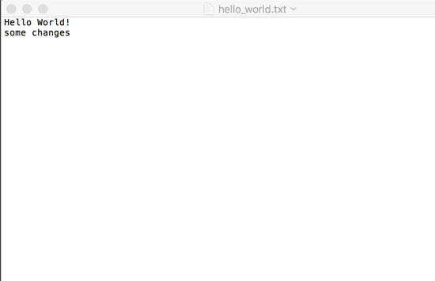
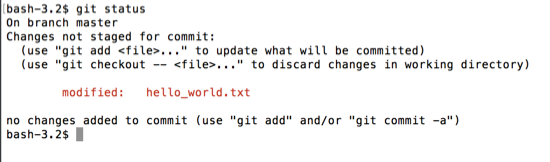
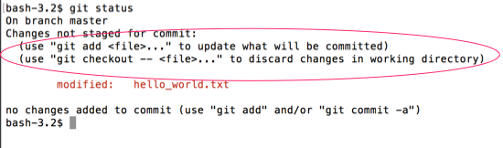
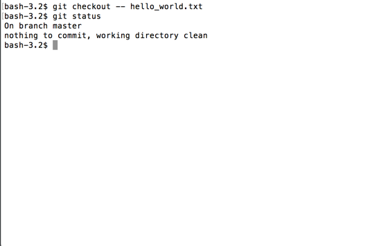
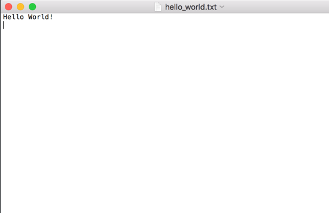

# git checkout

If we want to look at a certain point in history without changing our commit history, we can use `git checkout`.

`git checkout <hash>` will jump to that commit and the state of repo at that time.  It does not delete commits from your history, it places you at that exact point in your history.

To demonstrate, lets go back to the commit where we first added the `hello_world.txt` file.



```
$ git checkout 06ba36d96e1f1dcf905fd442ddd8d6546379178a
```



First you'll notice that git provides a big warning about this.  It wants you to be aware that you are no longer on the `HEAD` commit.  So committing at this point won't affect your history.  `git status` also warns us that we are in a `HEAD detached at <hash>` state.

Looking at the files in the directory with `ls` we see only two files, both empty, since we hadn't added text yet to them.



To return to the top of our project and be able to continue editing our project, use `git checkout master`.  `master` is the name of our branch.  Don't worry about that now, as we'll cover branching in a bit.

```
$ git checkout master
```



We're back to the most recent commit and can continue making changes again.

## Discard Changes

Let's edit our `hello_world.txt` again. Let's add "some changes".



If we `git status`, we'll see that `hello_world.txt` has been _modified_ and is _not staged for commit_ (hasn't been `git add`ed yet.)



You'll also see that git has given us some helpful text, recommending we use `git add` to stage it or `git checkout -- <file>` to discard the changes.



`git checkout -- <file>` will _undo_ changes made to the specified `<file>` that were made after the most recent commit.  It will remove them from the working directory.

If we use it on `hello_world.txt`, the text we just added "some changes" will disappear.

```
$ git checkout -- hello_world.txt
```



If we look inside the file, the text is gone.



This can be useful if you've made a lot of changes and don't want to remove them all from your editor manually.
