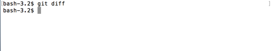
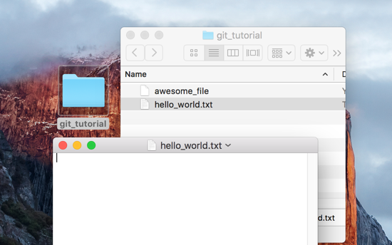
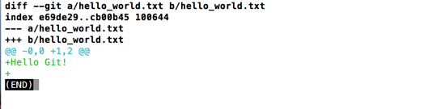
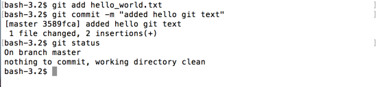
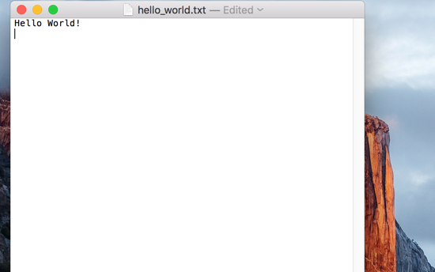
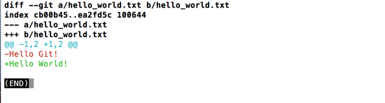
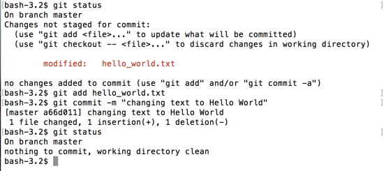

# git diff

Let's create a new file `hello_world.txt`, add it to git and commit it.

```
$ touch hello_world.txt
$ git add hello_world.txt
$ git commit -m "adding hello_world.txt"
```


## Empty Diff

Before we add some text to our new file, let's explore a new command. 

`git diff` will show any changes in your repo for _currently tracked files_.  

Remember tracked files are files that have been previously added and committed to git.  Right now, we are tracking `awesome_file` and `hello_world.txt`.  If we use `git diff` right now, it will open a new window with no text other than 'END'.  There are no uncommitted differences in the folder.

**Diff** may also be used as a noun to describe the changes between one point and another, in the cases below, showing the difference between the last commit and your current directory.

```
$ git diff
```


Type `q` to leave this screen and return to your command line prompt.




## Diff with additions

To demonstrate `git diff` in action, we'll need to edit one of our files.  Since the `git_tutorial` folder is located on your Desktop, you should be able to click it open and open `hello_world.txt` with a native text editor.



Let's add some text to our file, like `Hello Git!` followed by a blank line.


Now if we use `git diff`, we'll see some changes.

```
$ git diff
```



Now we can see, that our text `Hello Git!` and the new line are _additions_ to the file, signified by the green color, and the `+` that precedes the text.  Remember to `q`, to exit the diff.

Let's add and commit our changes to the file.

```
$ git add hello_world.txt
$ git commit -m "added hello git text"
```



## Diff with additions + deletions

Actually, we wanted our text to say `Hello World!` and not `Hello Git!`, since that matches our file name.  Let's edit the text.



Now if we do a `git diff`.

```
$ git diff
```



Now we can see that the line changed from `Hello Git!` (marked in red and starting with a `-` to show its _deletion_) to `Hello World!` (marked in green and starting with a `+` to show its _addition_)

Lets add and commit this change before moving on.

```
$ git add hello_world.txt
$ git commit -m "changing text to Hello World"
```

