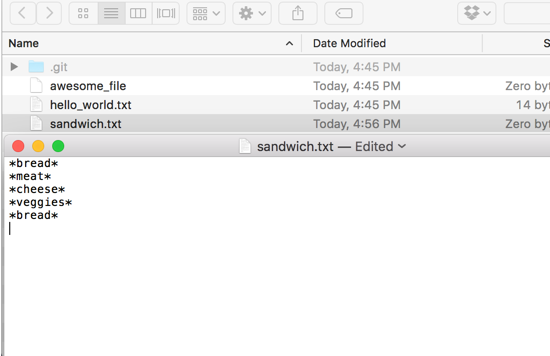
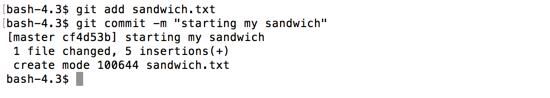
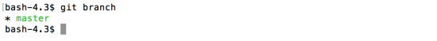
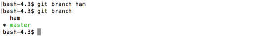
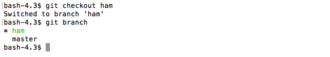
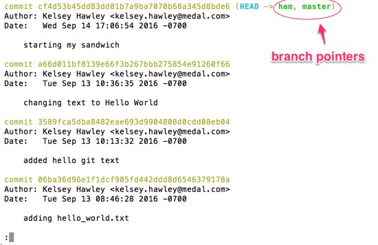
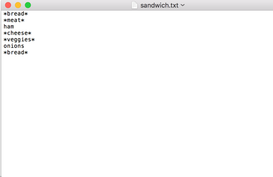
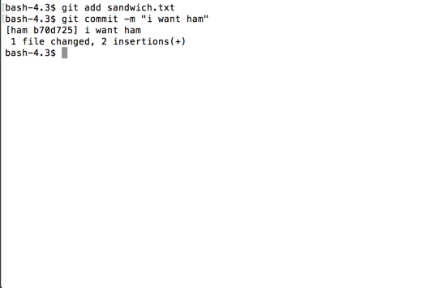
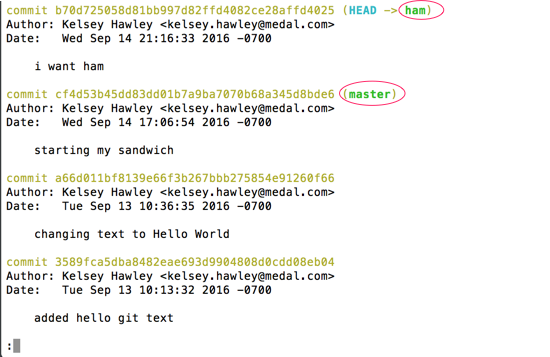

# git branch
Let's take that sandwich metaphor literally to explore the concept of branches.

## Sandwich Prep

Create a `sandwich.txt` with the following text:

```
*bread*
*meat*
*cheese* 
*veggies*
*bread*

```

You can use `touch` to create the file, and your editor to edit it.

```
$ touch sandwich.txt
```




Then `git add` and `git commit` it.

```
$ git add sandwich.txt
$ git commit -m "starting my sandwich"
```



`git branch` will show the list of all our branches and which branch we are currently on, designated by a `*`.

Let's check which branch we are on right now.

```
$ git branch
```



We only have one branch, the default `master`.  It has the `*` as well.


## Ham Sandwich


`git branch <new_branch_name>` will create a new branch, using your current branch as a starting point.

We have an idea for a ham sandwich, but we aren't sure its what we want.  So, lets create a `ham` branch to try it out.

```
$ git branch ham
$ git branch
```



We have two branches listed, but we are still on `master` (designated by the `*` and green text).  Let's switch to the `ham` branch.

`git checkout <branch_name>` checkouts the specified branch, allowing you to make changes.

```
$ git checkout ham
$ git branch
```



We can see that now the `*` is on `ham`.

And if we look at the log, we'll see that `ham` has all our previous commits from `master`.  There is also a pointer to our branch, along with master.

```
$ git log --decorate
```



I like ham as my meat.  And I also like onions.  Let's edit the file like this to reflect that.

```
*bread*
*meat*
ham
*cheese*
*veggies*
onions
*bread*

```



Then `git add` and `git commit`.

```
$ git add sandwich.txt
$ git commit -m "i want ham"
```



Now if I look at the `git log`, my `ham` branch pointer has moved to my most recent commit.  That commit, is not on `master`, so the pointer to `master` is still on the commit below.

```
$ git log --decorate
```


