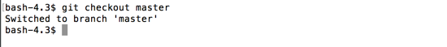
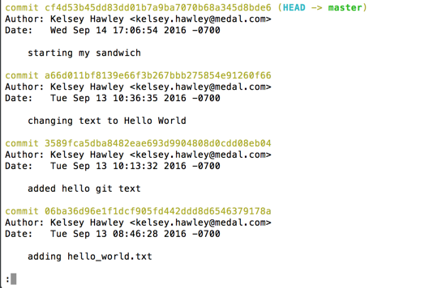
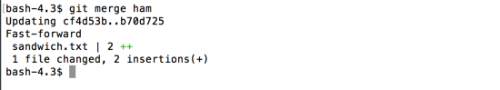
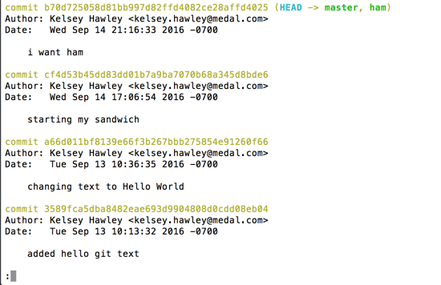

# git merge

I like how the ham sandwich turned out, so let's add it to `master`.

First, let's checkout `master`.

```
$ git checkout master
```



We're back on the `master` branch.  Let's see what our log looks like.

```
$ git log --decorate
```



The `ham` pointer is missing and our most recent commit.  That's because `master` isn't aware of changes that were made on another branch.

To add our ham commit to `master`, we need to use `git merge`.

`git merge <branch_name>` merges all the changes made the named branch into your current branch.

```
$ git merge ham
```



This merges our ham commit into `master`.  You can see it added two lines (2 insertions) that we made to `sandwich.txt` into the `master` branch.

We can also see in the log that `ham` and `master` are pointing to the same commit again.

```
$ git log --decorate
```



