# Merge Conflicts

Our last merge went rather smoothly, but not all merges do.  Let's demonstrate what a merge conflict looks like and how we can resolve it.

## Conflict Prep

Let's start a new branch called `swiss`, cause I like a bit of swiss with my ham sandwich.  But don't switch to that branch just yet.

```
$ git branch swiss
```

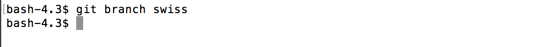

But, I also like cheddar on my ham sandwiches.  I'm gonna edit the text to say cheddar, under cheese.  Remember, I'm still on the `master` branch making this change.

```
*bread*
*meat*
ham
*cheese*
cheddar
*veggies*
onions
*bread*

```

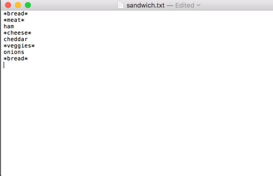

Then lets add and commit it.

```
$ git add sandwich.txt
$ git commit -m "adding some cheddar"
```

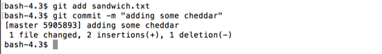

If you check the log, you'll see that `swiss` (and `ham`) is one commit behind `master` now.

```
$ git log --decorate
```

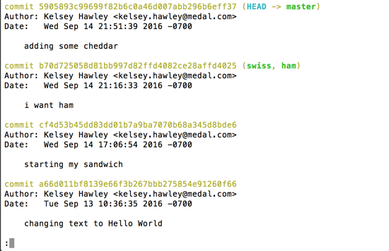

## Ready Conflict

Now lets switch into `swiss`.

```
$ git checkout swiss
```

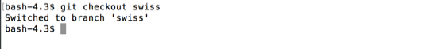

As we saw in `master`, `swiss` doesn't know about the cheddar related commit.  Let's just confirm that with a `git log`.

```
$ git log --decorate
```

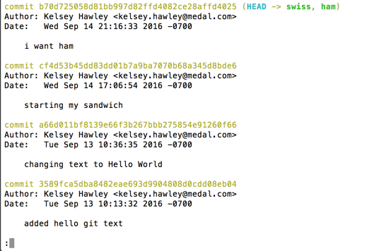

Nope, no cheddar there.

Since we're in the `swiss` branch, let's go ahead and add the swiss to our `sandwich.txt`.  I'm also gonna add some lettuce.

```
*bread*
*meat*
ham
*cheese*
swiss
*veggies*
onions
lettuce
*bread*

```


And then add and commit.

```
$ git add sandwich.txt
$ git commit -m "i prefer swiss"
```

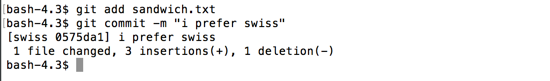

What do you think will happen when we try to merge it into `master`?


## Conflict!

Switch to `master`, then try to merge in `swiss`.

```
$ git checkout master
$ git merge swiss
```
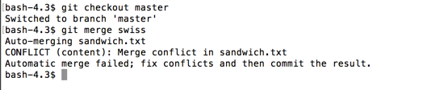

Git encountered a _conflict_ while trying to automatically merge our `sandwich.txt`.  Git also left us some helpful clues in `sandwich.txt`, to help us figure where the conflict happened.

Open up `sandwich.txt` to see what notations git has added to the file.

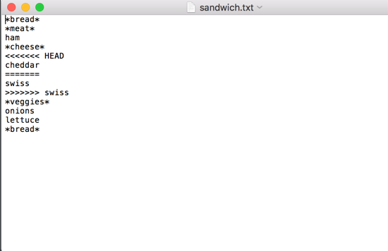

This may seem a bit intimidating at first glance, but it can be super helpful.

First, lets note the format:

```
<<<<<<< <current_location_name>
<current_text>
=======
<merging_in_text>
>>>>>>> <mergin_in_location>
```

We can see that `HEAD`, which is our current spot on `master` added "cheddar".  And the top part shows us that.

Then after the `=======`, we see that "swiss" came in from the branch we were merging in, `swiss`.

Ok, so, how do we fix it?

## Cleaning up a Conflict

First, pick which is correct, "cheddar" or "swiss".  Then remove the incorrect line, and the lines that git added (prefixed by `<<<<<<`, `========`, `>>>>>>`).

I'm gonna pick "cheddar", because if I'm honest, I'm not actually a fan of holey cheese.

To resolve my conflict with "cheddar", I'm gonna remove the "swiss" line, and the git lines.

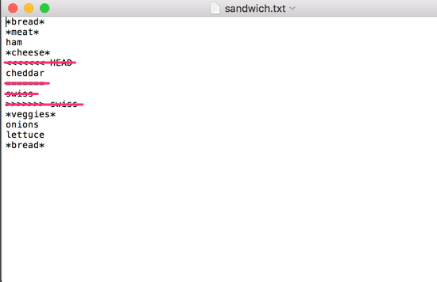

You'll notice this looks a lot like our original cheddar commit, except that this one includes the "lettuce" we also added in our `swiss` branch.

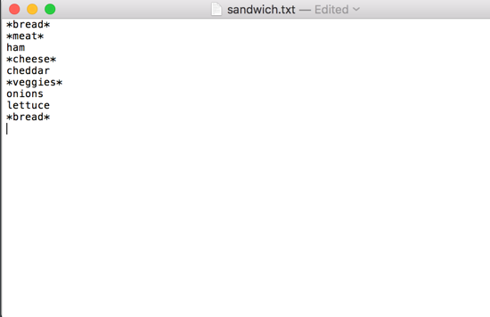

Now if we do a `git status` we can see how we finish this merge conflict.

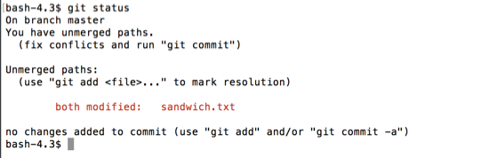

Git tells us that, after we've fixed the conflict (which we did above), we need to `git add` that file.

```
$ git add
$ git status
```

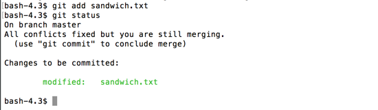

To conclude the merge, we need to do a `git commit`.

```
git commit -m "Merge branch 'swiss'"
```

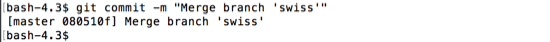

We have resolved the conflict!

Another way to resolve the conflict would have been to choose _both_ cheeses for our sandwich.  The conflict could have been resolved by having one, the other, or both lines chosen to resolve the conflict.
