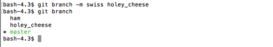

# Rename or Delete Branches

`git branch -m <old_name> <new_name>` will rename a branch to a new name.

```
$ git branch -m swiss holey_cheese
```



`git branch -d <branch_name>` will remove the branch, and its associated commits.

```
$ git branch -d holey_cheese
```


_Note:_ you can't delete the branch you are currently on.  If you could, git wouldn't know where to put you after it was deleted.


