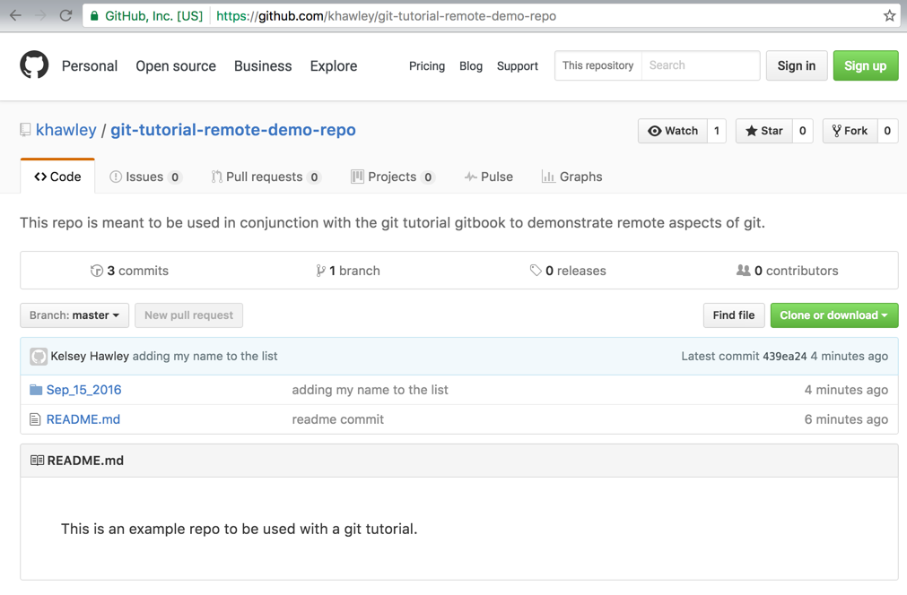

# git remote

A **remote** server location is a place where an external copy of your project is kept.  You can think of it like Dropbox or Google Driver, except it preserves your git history.  Most remotes are also built around collaboration, with easy sharing and tools like _pull requests_ to allow other users to contribute.

GitHub, Bitbucket, and GitLab are all examples of different remotes you could have configured.  Many companies create their own versions to serve as a private and internal remote server.

`git remote` is the command that lists the aliased names of the remotes configured for your repo.

Since we started our project locally, it has no remote configured.

```
$ git remote
```


Let's use an open source repo created for this tutorial as a starting point.

Click on the link here to go to the [Demo Repo](https://github.com/khawley/git-tutorial-remote-demo-repo)

You should see a page like this:


