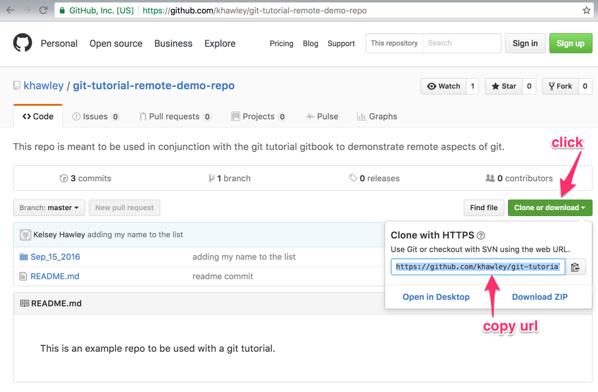
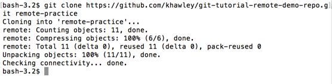
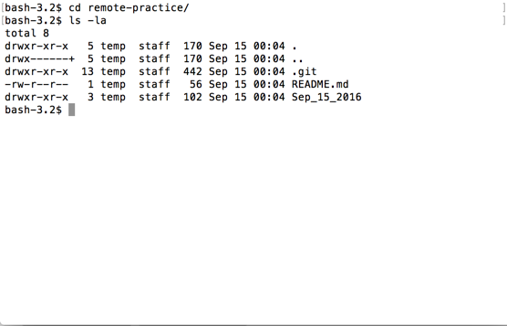
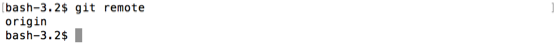
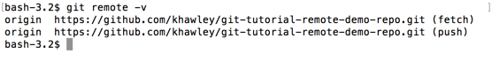
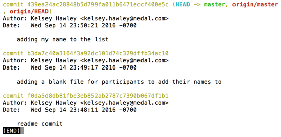

# git clone

On that page, click the big green "Clone or Download button" and then copy the link.



You may notice there are other options than "Clone with HTTPS".  Ignore those for now.  The https url is the easiest to get started using.

`git clone <remote_url> <folder_to_clone_into>` is the command to copy a remote repository (at `<remote_url>`) to your local computer.  It will copy or 'clone' the contents into the specified folder.

First `cd` onto your Desktop, then `git clone` the link.

```
cd ~/Desktop
git clone https://github.com/khawley/git-tutorial-remote-demo-repo.git remote-practice
```



Now if you `cd` into that directory, you'll probably see a `README.md` and a folder there.

```
cd remote-practice
ls -la
```



You can also do a `git remote` to see we have something called `origin` there now.

```
$ git remote
```



`origin` is the default remote name in a repo, just like `master` is the default branch name in a repo.

`git remote -v` will show us the _verbose_ name of our remote repo.

```
$ git remote -v
```



You should see that the link we copied earlier to clone the repo is the same as the url listed with our `git remote -v` command.

If we do a git log, you'll see a new pointer next to the commits too.



`origin/master` and `origin/HEAD` now appear as pointers.  This will be useful as you learn to push and pull, to be aware of what is still a _local only_ commit and what exists on both.
