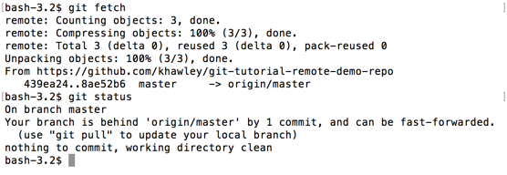
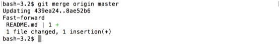
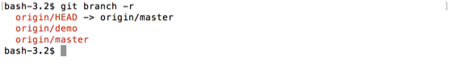
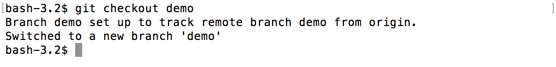

# git fetch

`git fetch` will grab any new branches or changes that exist on the remote, but do not yet exist on your machine.  This does not merge any of those changes, it keeps them in the background so you can merge them in yourself.

Since you just cloned the repository, you shouldn't have any changes, but I'll show a screenshot of what it might look like.

```
git fetch
```



You can see that it grabbed some new data from the remote.  When I followed it with a `git status`, I can see that my local branch is "behind 'origin/master' by 1 commit".

To merge that commit in, I can do a `git merge <remote> <branch>`



You saw in the `git status` I had been 1 commit behind.  If I make changes locally, then I am _ahead_ of the remote branch.

First, let's see if there are any remote branches we don't know about.

`git branch -r` will list all the _remote_ branches of the repo.

```
$ git branch -r
```



Let's checkout that `demo` branch. Since its a branch that already exists in the remote repo, we don't need to create it first.

```
$ git checkout demo
```



Now lets make a change and commit it here. `cd` into the folder with today's date and add your name to the `participants.txt` in the folder that matches today's date.  (If you are reading this outside of a workshop, feel free to create a new directory with today's date, and add a file called `participants.txt` there with your name in it)

After your changes:

```
$ git add participants.txt
$ git commit -m "added Kelsey to the list of participants"
```

If we run `git status`, we'll see that we are one commit _ahead_ of `origin/demo`.
