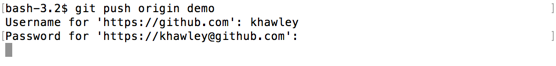
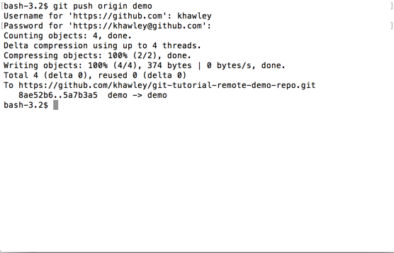
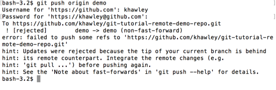
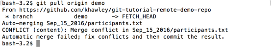
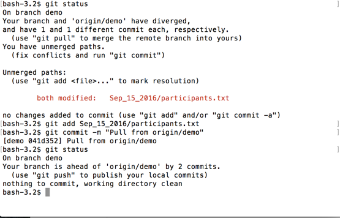
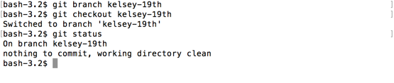
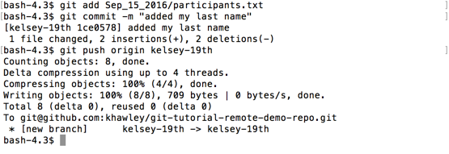

# git push

## Push conflicts

To add our changes to the remote, we will need to `git push`.

`git push <remote> <branch>` pushes any local changes to the branch up to the remote repo, keeping things in sync.

Let's push our name change up.

```
git push origin demo
```

Unless you have pushed before, you'll likely get a login prompt, like this.



Type in your GitHub username and password to allow you to push for the first time.  This should be saved on your machine, so you'll only need to login to push this first time.

Some of you will see a push like this, that was successful and your commits were put on the remote.



But most of you will see a message like this, because someone beat you to it!



Your branch is now out of date with the remote.  This means someone added a commit to the remote, that you don't have locally.  You'll have to update your local repository first.  Do a `git pull`, then try your `git push` again.

```
$ git pull origin demo
```



You may even have to deal with merge conflicts coming in from the remote.  Like we talked about when resolving merge conflicts, you'll need to resolve them first.  Then add and commit them.



Depending on how many people are pushing and pulling to this branch at this moment, you may have to pull (and resolve conflicts) multiple times before your commit goes live.

## Push bliss

If you're getting frustrated, try creating a new branch with your name and the day you were born.  I recommend this combo, because its possible we might have two Kelsey's, but both may not be born on the 19th.

```
$ git branch kelsey-19th
$ git checkout kelsey-19th
```



Now I can makes changes, push and pull to that branch and not worry about being out of date or conflicting with all the other usings trying to push at the same time.

Just remember to use your new branch name when pushing.

```
$ git push origin kelsey-19th
```



You can see my new branch was created on the remote, and my changes were successfully pushed.
