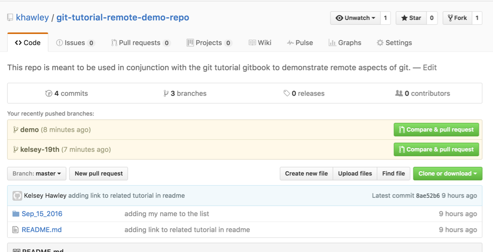
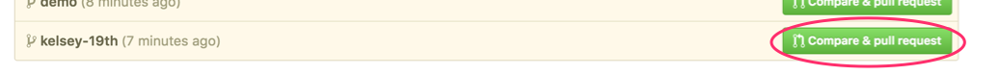
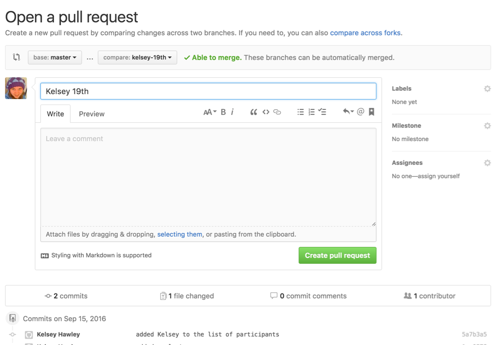
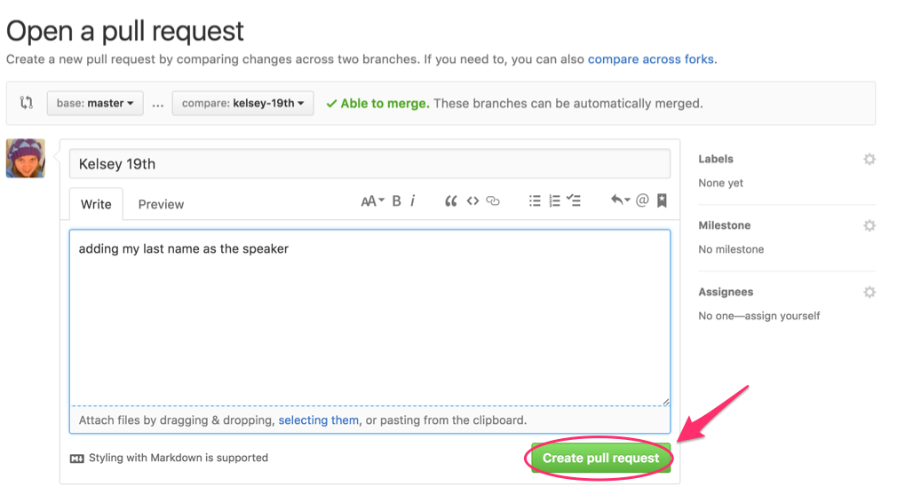
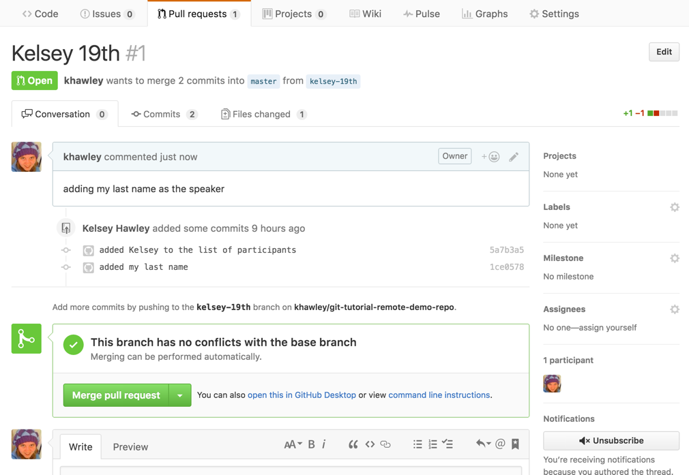
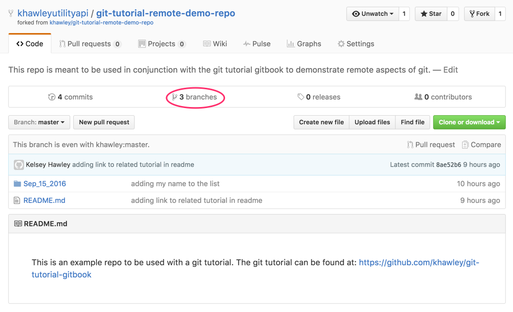
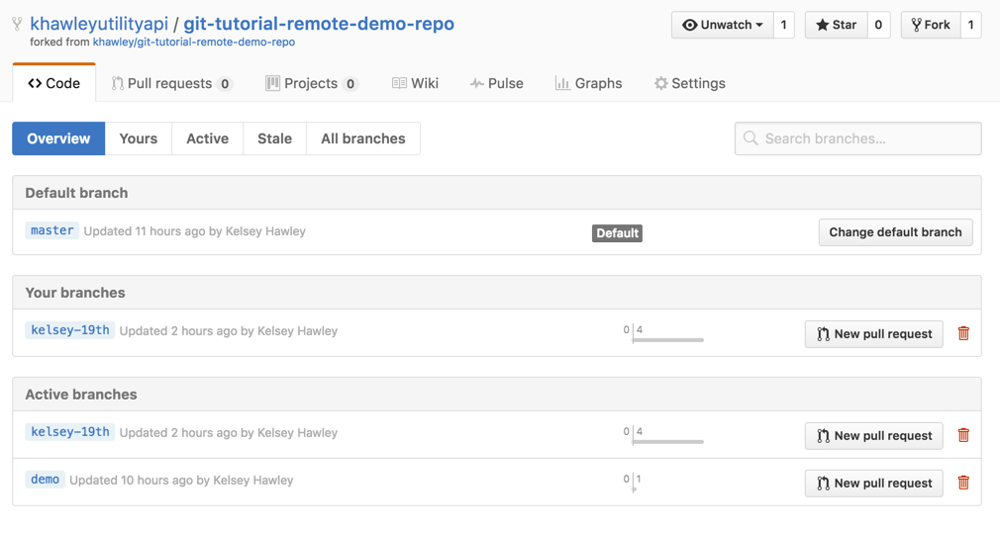
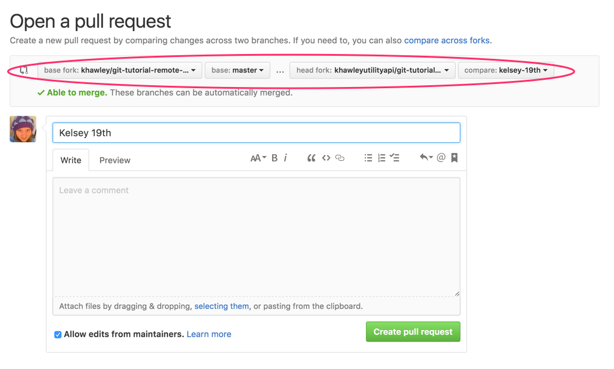
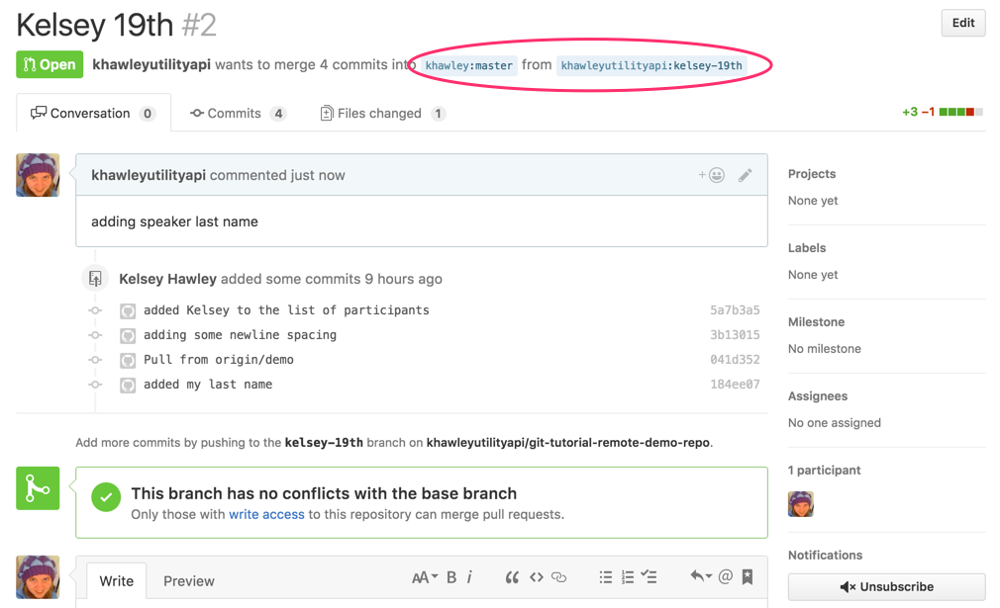

# Pull Requests

**pull request** is a way of requesting that changes you have made be reviewed and added to the main branch of a project.  Most open source projects do not allow outside contributors to commit directly to `master`.  Instead, you would create a branch, make your changes, then request that your branch be merged into `master`.  You can only create a pull request by using a remote service like GitHub.  Some websites may call them _merge requests_ instead of _pull requests_.

Let's create a pull request for the branch you named after yourself.  Go to the  again.

You'll probably see a list like the above, with new branches that have been pushed up.  Let's click "Compare & pull request" for the branch you just made.  For me, it will be for `kelsey-19th`.

The new page will ask you what to call your pull request (auto-filled with the branch name) and what message should be attached to it (often the commit message if only one commit).

You can also see that it is comparing our branch `kelsey-19th` with the base branch `master`.

As you scroll down, you'll see a diff of what you added in this branch, compared to the base branch.

Go ahead and type in a message and "Create pull request".

You'll see a screen like this

Now the owners of the repo can review your changes, leave comments or suggestions if needed and eventually merge or decline your pull request.

## Forked users

You will have a slightly different workflow.  If you don't see your recent branch highlighted in yellow on your repo, you can go to the branches link.

Then create a new pull request on your branch.

Take special note of the branching + base settings at the top.  You see the 'base fork' is the original project link, and the 'head fork' is your forked repo.

You can also see this reflected in the created pull request.

