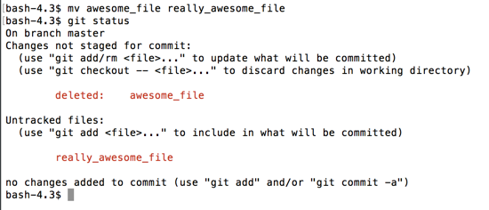
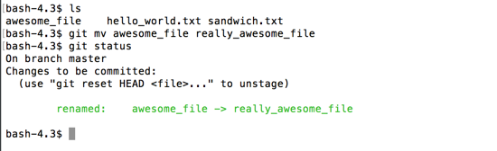
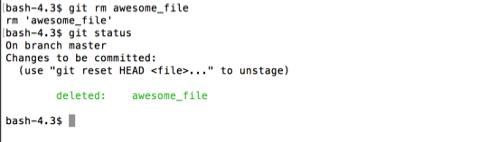

# Extras

Some commands we didn't cover during the tutorial but are useful to know.

## git mv {#git-mv}

If you're renaming a file, its always best to use `git mv`.  This tells git to link the history with the file's old name and its new name.

`git mv <old_name> <new_name>` will perform a `mv` on the file and will link the history of the two file names.

Using `mv`, git can't track the rename:

Using `git mv`, git is aware that the file has been relocated.

## git rm {#git-rm}

`git rm` is like the reverse of `git add`.  With `git add`, you're adding a file to be tracked, or adding changes to a tracked file.  With `git rm`, you are deleting that file, and telling git you don't want it tracked anymore.

`git rm <file_name>` will perform an `rm` on the file locally and tell git that it has been deleted, and will no longer be tracked.

